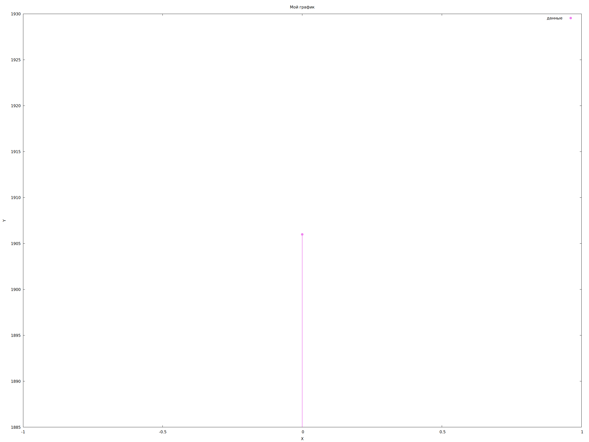
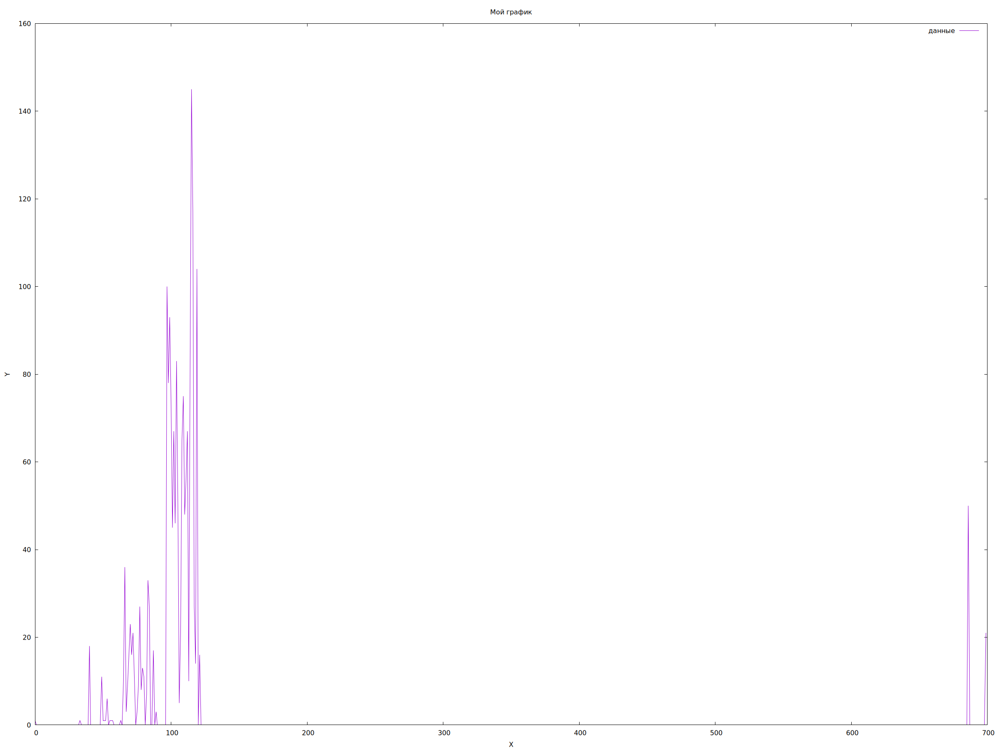
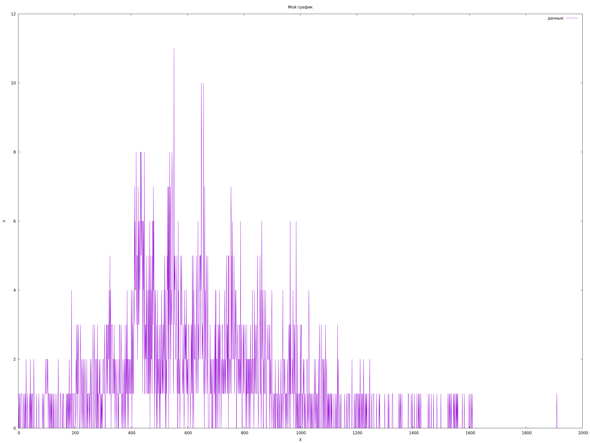
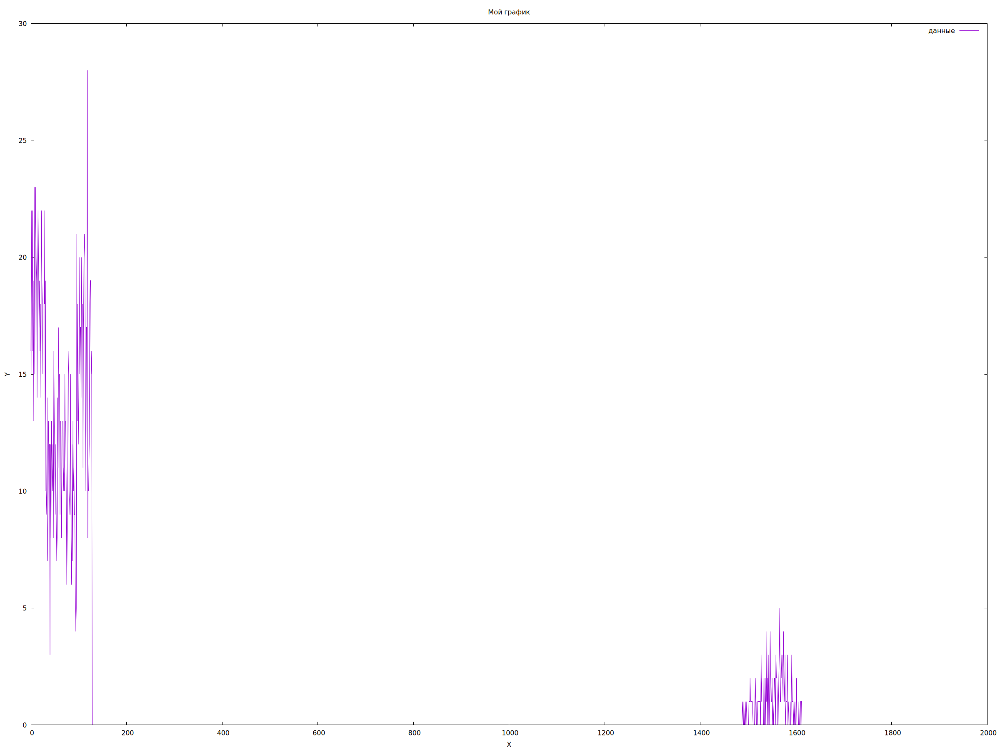
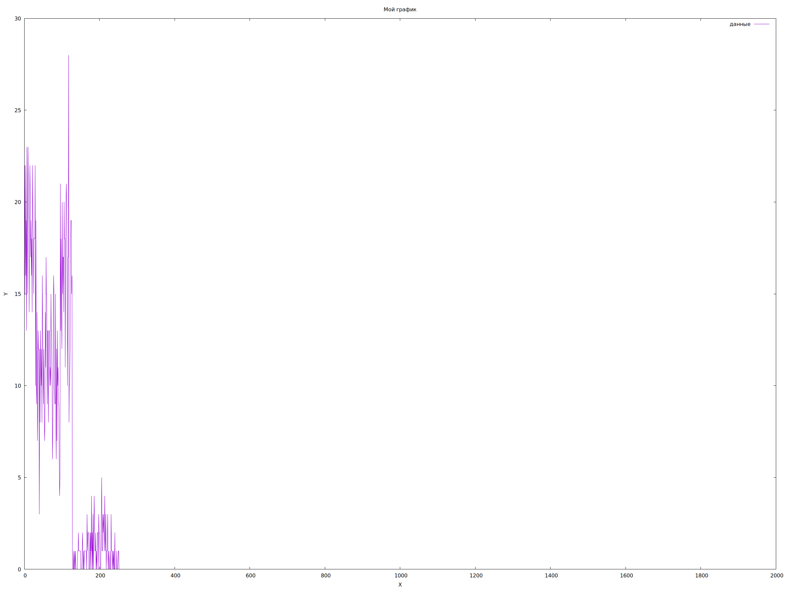
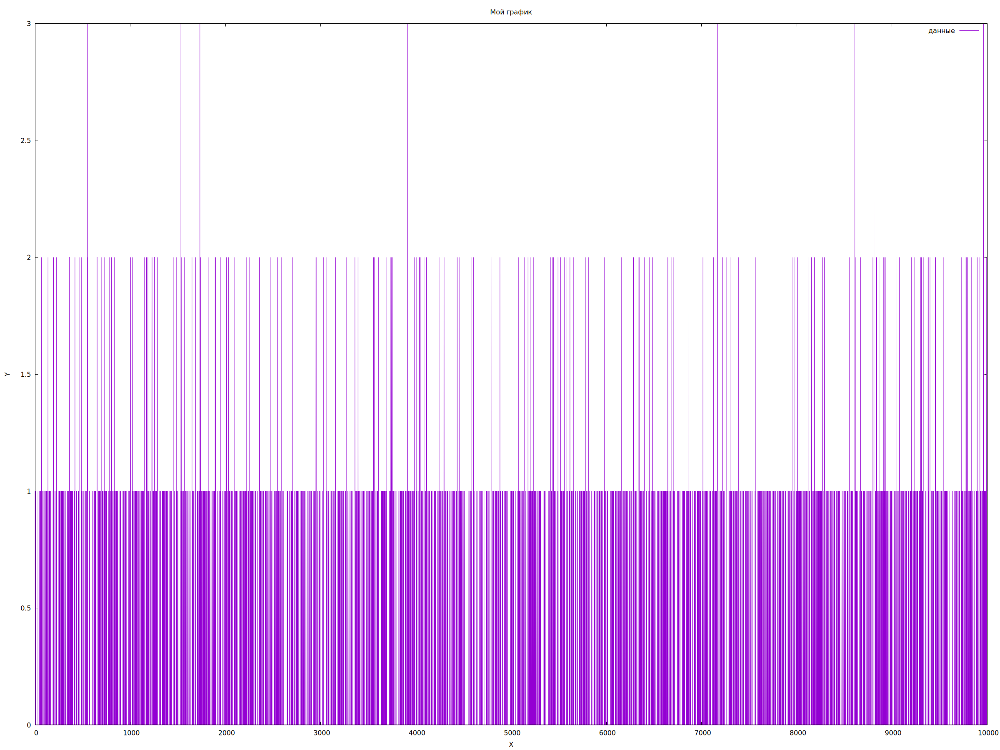
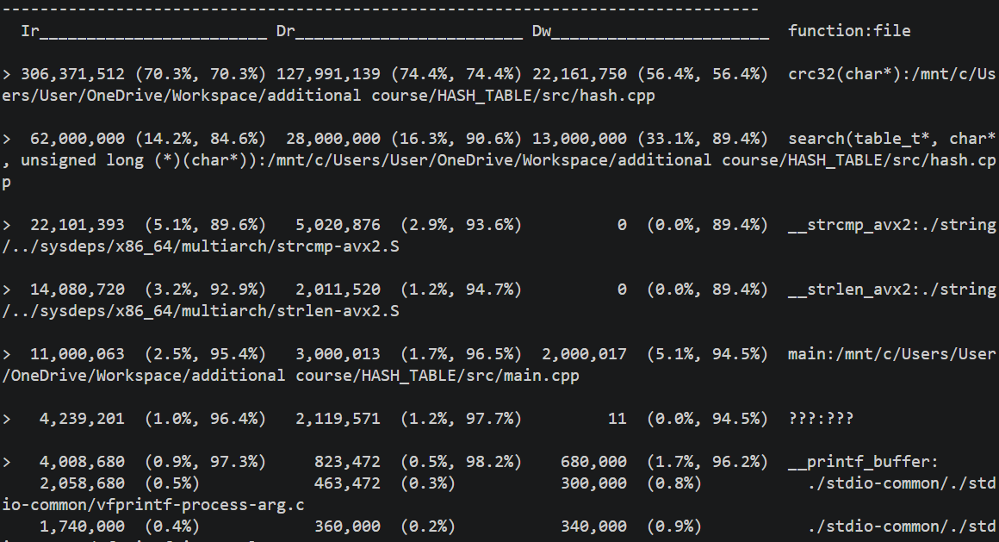

# Лабораторная работа - хеш-таблица
## Содержание
[Цели и задачи](#Цели)

[Выстроение плана работы](#План)

[Ход работы шаг за шагом](#Ходработы)

[Обсуждение результатов и выводы](#Выводы)

[Использование проекта](#Использование)

## План
Данная работа строится в несколько этапов, каждый следующий из которых является логическим продолжением предыдущего.

**Первый этап**: 

 построение хеш-таблицы, структуры, являющейся массивом односвязных динамических списков.
 Нужно это для удобства и наглядности работы. Затем эта таблица наполняется словами по правилу: в список с индексом hash(значение хеша слова, полученного с помощью некоторой исследуемой функции) помещается это слово. Источником слов является некий текст, взятый из интернета. 

**Второй этап**: 
 после того, как данные были подготовлены, можно приступать к их анализу. Показатель пригодной к работе хеш-функции это равномерное частотное распределение: чем меньше слов приходится на один хеш - тем он лучше. Графики распределения для каждой функции будут строиться с помощью gnuplot.

**Третий этап**: 
 на этом этапе грубый отбор функций кончается, можно подумать над более тонкими вопросами: например, как оптимизировать поиск слова в таблице. Перебор сведён к минимальному, построением удобной структуры данных, а также выбором лучшей(по параметру распределения) функции. Следующий шаг - оптимизации, связанные с особенностями архитектуры. Для понимания того, сколько ресурсов тратит каждая функция, будет использоваться valgrind, а именно cashegrind. По ходу работы будут построены benchmarks, на которые нужно будет ориентироваться при внедрении ассемблерных оптимизаций, а также intrinsics
## Цели

Построение хеш-таблицы; Анализ хеш-функций и нахождение лучшей среди них; Изучение и использование профиляторов; Оптимизация поиска слова в таблице.

## Ход работы

**(|)**
После создания хеш-таблицы как структуры, её нужно наполнить данными. Сделано это путём буферизации текста первой части "Game of thrones". В таблицу было внесено около 2000 неповторяющихся слов.

Хеш-таблица была построена, теперь к анализу:

## *hash_zero:*

Нулевой хеш совершенно очевидно, не подходит, сделан он для того, чтобы показать крайний (самый худший) случай поиска по хешу (все слова имеют один хеш)ж

## *hash_first:*

Хеш, который определяется первым символом слова имеет очень неравномерное распределение. Как видно из графика, основное скопление слов произошло в районе hash = 100; Функция совершенно точно не подходит для быстрого поиска(наибольшее число слов в списке составляет 140, это чрезмерно много).

## *hash_word:*

Хеш, возвращающий сумму ASCI кодов символов слова уже лучше, но всё ещё распределение неравномерное, что хорошо видно из графика. Максимальное количество слов в списке доходит до 11, что едва ли можно назвать приемлемым для быстрого поиска.

## *hash_xor:*

Хеш возвращает значение от последовательного применения xor к первому символу и остальным символам слова. Распределение не является равномерным, максимальное количество слов в списке примерно 30, это не подходит под нашу задачу

## *hash_xor_reversed:*

Хеш возвращает значение от последовательного применения xor к последнему символу и остальным символам слова. Ситуация аналогичная *(hash_xor)*

## *crc32*

Хеш основан на циклических перестановках и последовательном применении xor к значению хеша. Распределение является лучшим из всех представленных хеш-функций, оно равномерно в очень большом диапазоне. Максимальное количество слов в списке равно 3. Эту функцию мы и будем использовать в дальнейшей работе

**(||)**
(полная информация о каждом бенчмарке: [Папка с данными cache_grind](./cache_grind))

*Benchmark-промах:*

Первый benchmark даже не включает в себя функцию поиска, связано это с тем, что она была вызвана всего один раз. В последующем анализе количество вызовов будет измеряться миллионами, чтобы анализировать её быстродействие стало возможным.

*Benchmark для неоптимизированной версии:*

Теперь количество вызовов search увеличено до 1000000, что является оптимальным числом, для последующего измерения быстродействия. 

## Выводы