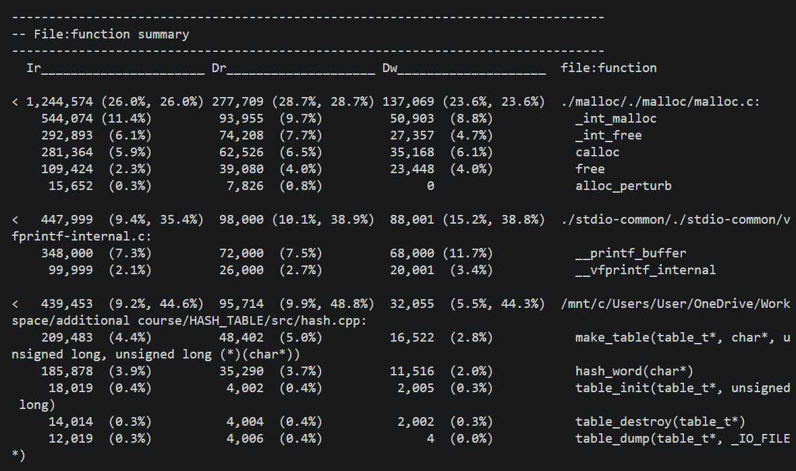

# Лабораторная работа - хеш-таблица
## Содержание
-[Цели и задачи](#Цели)
-[Выстроение плана работы](#План)
-[Ход работы шаг за шагом](#Ходработы)
-[Обсуждение результатов и выводы](#Выводы)

## План
    Данная работа строится в несколько этапов, каждый следующий из которых является логическим продолжением предыдущего.

    Первый этап: 
     построение хеш-таблицы, структуры, являющейся масивом односвязных динамических списков.
     Нужно это для удобства и наглядности работы. Затем эта таблица наполняется словами по правилу : в список с индексом hash(значение хеша слова, полученного с помощью некоторой исследуемой функции) помещается это слово. Источником слов является некий текст, взятый из интернета. 

    Второй этап: 
     после того, как данные были подготовлены, можно приступать к их анализу. Показатель пригодной к     работе хеш-функции это равномерное частотное распределение: чем меньше слов приходится на один хеш - тем он лучше. Графики распределения для каждой функции будут строиться с помощью gnuplot.

    Третий этап: 
     на этом этапе грубый отбор функций кончается, можно подумать над более тонкими вопросами: например, как оптимизировать поиск слова в таблице. Перебор сведён к минимальному, построением удобной структуры данных , а также выбором лучшей(по параметру распределения) функции. Следующий шаг - оптимизации , связанные с особенностями архитектуры. Для понимания того, сколько ресурсов тратит каждая функция, будет использоваться valgrind, а именно cashegrind. По ходу работы будут построены benchmarks, на которые нужно будет ориентироваться при внедрении ассемблерных оптимизаций, а также intrinsics

## Цели

## Ход работы

## Выводы